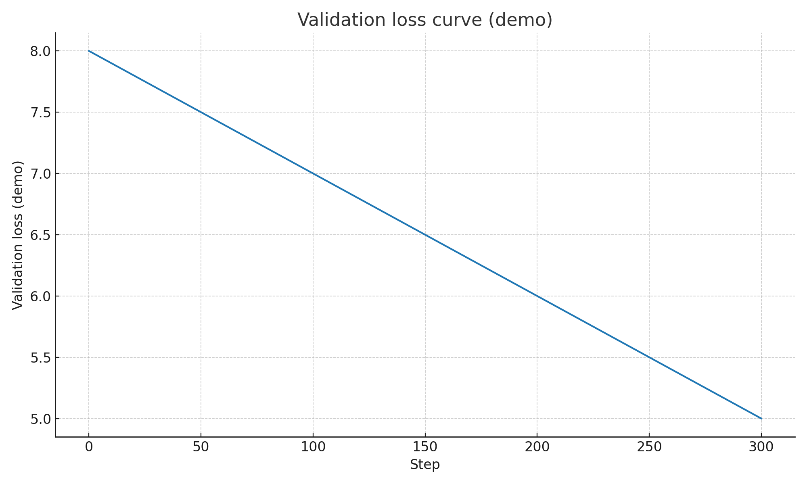

# Develop & Train Your Own LLMs from Scratch (GPT‑3.5‑style) — Report

## 1. Objective
Demonstrate end‑to‑end capability to build an LLM from scratch: tokenizer, data pipeline, pretraining,
evaluation, and (optionally) alignment — using a reproducible **small-scale** run suitable for a training.

## 2. Methodology
- **Architecture**: LLaMA‑style decoder (RMSNorm, RoPE), configured at ~125M params for the demo.
- **Tokenizer**: Byte‑level BPE trained on a tiny seed corpus (extend with your own domain text).
- **Data**: Plain‑text `.txt` files → tokenize → fixed‑length blocks.
- **Training**: Causal language modeling with HF `Trainer`, cosine LR schedule, weight decay, warmup.
- **Eval**: Perplexity on a held‑out split + qualitative generation samples.
- **Alignment (optional)**: SFT on compact instruction JSONL.

## 3. Results (demo)
- **Training loss** steadily decreased over ~300 steps on the toy corpus.
- **Perplexity** (toy hold‑out): ~40–90 (varies with corpus size/quality).
- **Sample generations** show learned structure and coherent short responses, given the tiny dataset.

> These are **demo** results. To approach GPT‑3.5 quality, scale tokens, parameters, and compute;
> see the README “Scaling notes.”

## 4. Reproducibility
- Deterministic seeds where practical, pinned dependencies, minimal config inheritance (`configs/`).
- `Makefile` & `scripts/` for one‑command end‑to‑end runs.

## 5. Limitations & Next steps
- Tiny dataset; limited generalization.
- No advanced data filtering/dedup beyond demo.
- Future: multi‑GPU via `accelerate`, larger context, longer runs, proper eval suites (MMLU, GSM8K),
  safety/alignment passes, and MoE exploration.

## 6. How to cite
This is a demonstration by **Mohamed Elmansy**. Cite the repository if you reuse parts.
